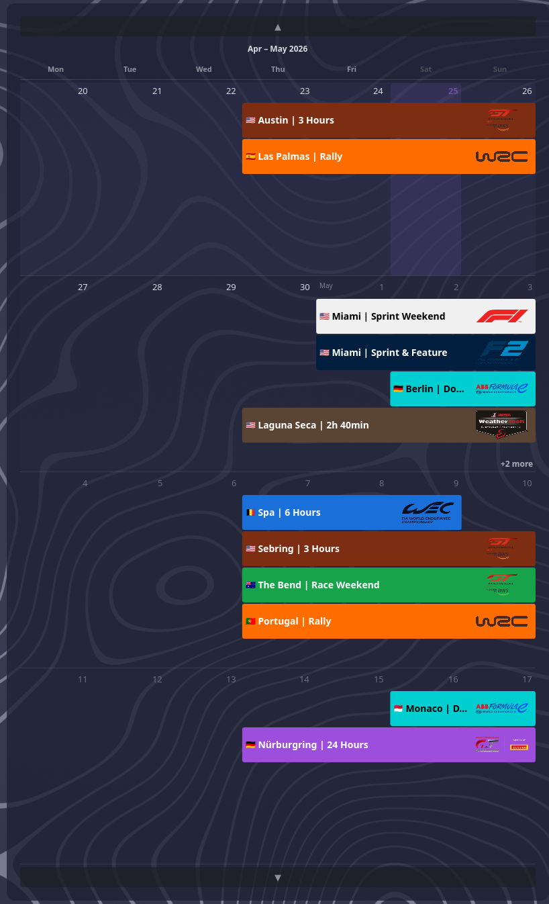

# Motortime

> [!WARNING]
> This thing is vide-coded. I needed a working custom widget for my own purposes. The code quality is not a factor. Take it for what it is or leave it.

A KDE Plasma 6 desktop widget showing a rolling motorsport calendar. Week count is configurable (1–8). Each series gets a configurable color and logo; events render as multi-day bars with country flags and labels.

## What it looks like



- Bars span the actual event days (Thursday–Sunday for a typical F1 weekend)
- Overlapping events stack into lanes; bar height is fixed, so fewer weeks = more lanes visible per row
- Labels adapt to bar width: full (`🇯🇵 Suzuka | Grand Prix`), city only, or flag only
- Multi-week events are split across rows with `◀ ▶` continuation markers
- Navigate with the ▲ ▼ buttons or mouse wheel
- When a row has more events than fit, a `+N more` label appears — click it to zoom into that single week; a Back button restores the normal view

## Supported series

| Key | Series |
|-----|--------|
| F1 | Formula 1 |
| F2 | Formula 2 |
| F3 | Formula 3 |
| FE | Formula E |
| WEC | FIA World Endurance Championship |
| IGTC | Intercontinental GT Challenge |
| IMSA | IMSA WeatherTech SportsCar Championship |
| NLS | ADAC Nürburgring Langstrecken-Serie |
| GTWC Europe / America / Asia / Australia | GT World Challenge |
| WRC | FIA World Rally Championship |

Each series can be enabled/disabled, reordered, and given a custom color in the widget's settings panel. The panel also exposes scroll sensitivity and the number of weeks to display.

## Architecture

```
scraper/          Python — fetches iCal feeds from toomuchracing.com
  main.py         entry point; outputs widget/contents/data/events.js
  series/         one module per series (f1.py, wec.py, gtwc.py, …)
  utils/
    ical.py       shared iCal fetch + date helpers
    flags.py      location → (display name, flag emoji) resolution

widget/           KDE Plasma 6 QML Plasmoid
  config/
    main.xml      KConfig schema (per-series color, enabled, order)
  contents/
    ui/
      main.qml          calendar grid (configurable week count)
      configGeneral.qml settings panel
    data/
      events.js         generated event data (pragma library)
```

The scraper is run locally and its output (`events.js`) is committed with the widget. There is no runtime network access — the widget reads the bundled file.

## Running the scraper

Requires [uv](https://github.com/astral-sh/uv).

```bash
cd scraper
uv run main.py              # scrape all series for current year
uv run main.py --series F1 WEC   # specific series only
uv run main.py --year 2025  # different year
```

Output is written to `widget/contents/data/events.js` by default.

### Taskfile shortcut

If you have [Task](https://taskfile.dev) installed, `task update` scrapes all series and reloads the Plasma shell.

## Installing the widget

```bash
kpackagetool6 --install widget/
```

Or right-click the desktop → *Add or Manage Widgets* → *Install from local file* and point it at the `widget/` directory.

After the widget is on the desktop, right-click it to open settings and configure series visibility and colors.

## Event data format

`events.js` is a QML pragma library:

```js
.pragma library

var events = [
    { series: "F1", location: "Suzuka", event_type: "Grand Prix",
      flag: "🇯🇵", start: "2026-03-27", end: "2026-03-29" },
    …
]
```
